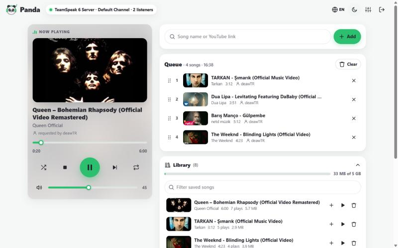
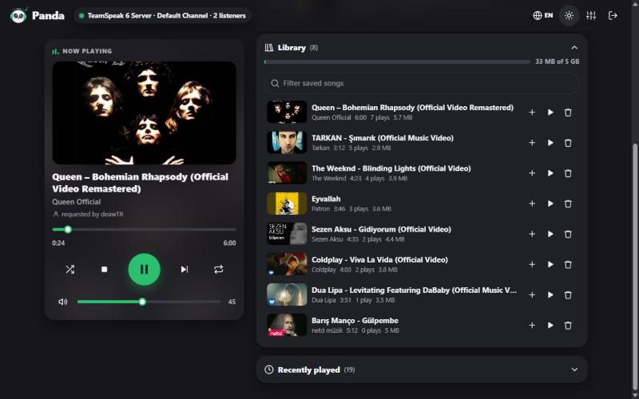
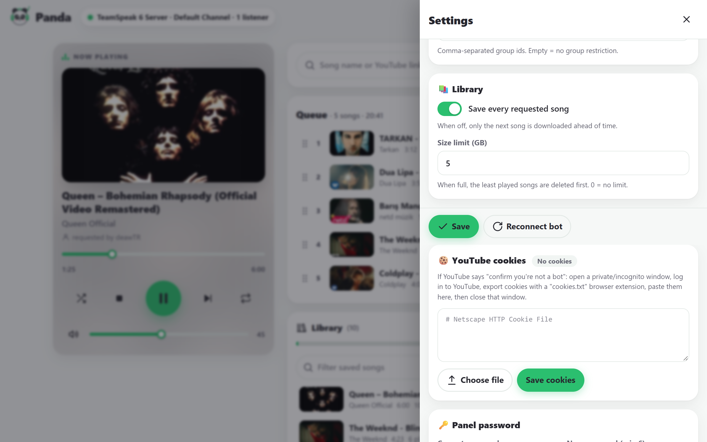

<p align="center">
  
</p>

<h1 align="center">Panda 🐼</h1>

<p align="center">
  A tiny, cute YouTube music bot for <b>TeamSpeak 6</b> — with a lovely web panel.<br>
  <a href="https://kaanbahasever.github.io/panda/">Website</a> ·
  <a href="README.tr.md">Türkçe</a>
</p>

<p align="center">
  <a href="https://github.com/KaanBahaSever/panda/releases"></a>
  <a href="LICENSE"></a>
  
</p>

---

Panda joins your TeamSpeak server and plays music from YouTube. Type `!play` and a song name or link
in the chat, or use the web panel. No plugins, no scripts, no TeamSpeak client running in the background:
Panda talks to the server directly, so it stays light: the bot itself uses about 130 MB of RAM, and
`yt-dlp` + `ffmpeg` only run while a song is playing.



## Features

- 🎵 **YouTube only, done well** — search by name or paste any link: `youtube.com`, `youtu.be`,
  **YouTube Music**, Shorts. Playlist and album links add just one song (the one in the link,
  or the first one of the list) instead of loading the whole list.
- 📚 **Song library** — every song you request is saved on disk. Songs you play again start instantly
  and never touch YouTube again; when the library is full, the least played songs make room.
- ⚡ **No waiting between songs** — the next songs in the queue are downloaded ahead of time.
- 🐼 **Made for TeamSpeak 6** (TS3 servers work too).
- 🌐 **Web panel** — now playing, queue with drag & drop, search, library, history, volume, loop,
  seek, light/dark theme, English/Turkish.
- 💬 **Chat commands** in English and Turkish.
- 🍪 **YouTube bot check?** Paste your cookies in the panel and you're done.
- 🔁 Reconnects by itself, keeps its identity (so permissions stick), shows the song in its description.
- 📦 One file, one command to install. Runs on Linux (x64/ARM), Windows, macOS and Docker.
- 🔑 **No YouTube API key needed.**

## Song library

Every song that is requested is saved in the library folder (`/var/lib/panda/library`), up to a size
limit you choose (5 GB by default). When the limit is reached, Panda deletes the songs that were played
the least, so your favourites stay. While a song is in the library:

- it starts immediately (no YouTube request at all),
- `!play` finds it by name too — `!play bohemian` plays your saved *Bohemian Rhapsody*,
- it shows up in the panel's **Library**, where you can play, queue or delete it.

Saving can be turned off in **Settings → Library**; Panda then only downloads the next song ahead of
time and deletes it after playing.



## Install (Linux)

```bash
curl -fsSL https://raw.githubusercontent.com/KaanBahaSever/panda/main/scripts/install.sh | sudo bash
```

The installer asks for your TeamSpeak server address and the panel port, installs `ffmpeg`, `yt-dlp`
and `deno`, sets up a systemd service and prints the panel address and password. Run it again to update.

```bash
journalctl -u panda -f                    # logs
sudo systemctl restart panda              # restart
curl -fsSL https://raw.githubusercontent.com/KaanBahaSever/panda/main/scripts/install.sh | sudo bash -s -- --uninstall
```

`yt-dlp` updates itself every day (YouTube changes often and old versions stop working).

### Docker

```bash
git clone https://github.com/KaanBahaSever/panda && cd panda
docker compose up -d
docker compose logs panda                 # shows the panel password on first start
```

### Windows / macOS

Download the archive for your system from [Releases](https://github.com/KaanBahaSever/panda/releases),
install [ffmpeg](https://ffmpeg.org/download.html), [yt-dlp](https://github.com/yt-dlp/yt-dlp#installation) and
[deno](https://deno.com/) so they are on your `PATH`, then run `panda` (`panda.exe`). Settings are stored
in a `data` folder next to where you start it.

## First steps

1. Open the panel (`http://your-server:8080`) and log in with the printed password.
2. **Settings → Connection**: server address (`ts.example.com` or `1.2.3.4:9987`), server password,
   channel. The bot reconnects when you save.
3. Change the panel password under **Settings**.
4. In TeamSpeak, write `!play never gonna give you up` in the bot's channel. 🎶



## Chat commands

Write them in the bot's channel or in a private message to the bot.

| Command | Turkish | What it does |
|---|---|---|
| `!play <name or link>` / `!p` | `!çal` | Play now, or add to the queue |
| `!playnow <name or link>` | `!şimdiçal` | Skip the queue and play right away |
| `!skip` / `!next` | `!geç` | Next song |
| `!stop` | `!dur` | Stop and clear the queue |
| `!pause` / `!resume` | `!duraklat` / `!devam` | Pause / continue |
| `!queue` / `!q` | `!sıra` | Show the queue |
| `!np` | `!şimdi` | What's playing |
| `!vol <0-100>` | `!ses` | Volume |
| `!loop <off\|one\|all>` | `!tekrar <kapalı\|şarkı\|hepsi>` | Repeat |
| `!shuffle` | `!karıştır` | Shuffle the queue |
| `!remove <#>` / `!clear` | `!sil` / `!temizle` | Remove a song / clear the queue |
| `!join` | `!gel` | Come to my channel |
| `!help` | `!yardım` | List commands |

By default everyone can use the bot. To limit it, add TeamSpeak UIDs or server group IDs under
**Settings → Bot**.

## "Sign in to confirm you're not a bot"

YouTube sometimes blocks server IPs. Fix it with cookies from a YouTube account:

1. Open a **private/incognito** window and log in to YouTube.
2. Export the cookies with a `cookies.txt` extension (for example *Get cookies.txt LOCALLY*).
3. Close the private window right away (so the cookies stay valid).
4. Paste the file in **Settings → YouTube cookies**.

Using a secondary account is a good idea.

## Do I need a YouTube API key?

No. Panda searches and plays through [yt-dlp](https://github.com/yt-dlp/yt-dlp), which reads YouTube
the way a browser does, so there is no API key, no Google project and no daily quota. The only thing
YouTube may ask for is the bot check above, which cookies solve.

## Configuration

Everything is editable in the panel; the file is `/var/lib/panda/config.json` (or `data/config.json`).

```jsonc
{
  "server": { "address": "127.0.0.1:9987", "password": "", "channel": "Music", "channelPassword": "" },
  "bot": {
    "nickname": "Panda 🐼", "commandPrefix": "!", "language": "en",   // chat replies: "en" or "tr"
    "volume": 50, "announce": true, "showSongInDescription": true,
    "allowedUsers": [], "allowedServerGroups": [], "maxQueueLength": 100
  },
  "panel": { "listen": "0.0.0.0", "port": 8080 },
  "youTube": { "ytDlpPath": "yt-dlp", "ffmpegPath": "ffmpeg", "cookiesFile": "", "maxDurationMinutes": 60 },
  "library": { "enabled": true, "maxSizeMb": 5120, "path": "" }   // 0 MB = no limit; empty path = data/library
}
```

Reset the panel password: `sudo -u panda /opt/panda/panda --data /var/lib/panda set-password <new>`.

The panel speaks plain HTTP. If it is reachable from the internet, put it behind a reverse proxy with
HTTPS (Caddy, nginx) or a firewall.

## Building

```bash
dotnet build src/Panda                    # needs the .NET 8 SDK
bash scripts/build-release.sh linux-x64   # single-file release in dist/
```

## How it works

Panda is a C# (.NET 8) app built on [TSLib](https://github.com/Splamy/TS3AudioBot), a TeamSpeak client
library. TeamSpeak 6 servers send a new license block during the handshake that TSLib didn't understand;
Panda carries a small patch that reads it (see [`lib/`](lib/README.md)). Audio comes from `yt-dlp`, is
decoded by `ffmpeg` and encoded to Opus with [Concentus](https://github.com/lostromb/concentus).

## License

Panda is licensed under the [Open Software License 3.0](LICENSE), like the TSLib library it builds on.

Thanks to TS3AudioBot/TSLib, [tsclientlib](https://github.com/ReSpeak/tsclientlib), [yt-dlp](https://github.com/yt-dlp/yt-dlp),
[Concentus](https://github.com/lostromb/concentus) and [ffmpeg](https://ffmpeg.org/).
Panda is not affiliated with TeamSpeak or YouTube.

Panda was built with the help of [Claude](https://claude.ai) (an AI assistant) and tested on a real
TeamSpeak 6 server.
