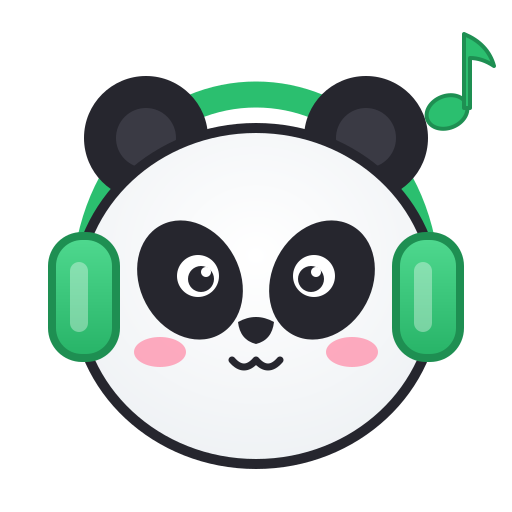
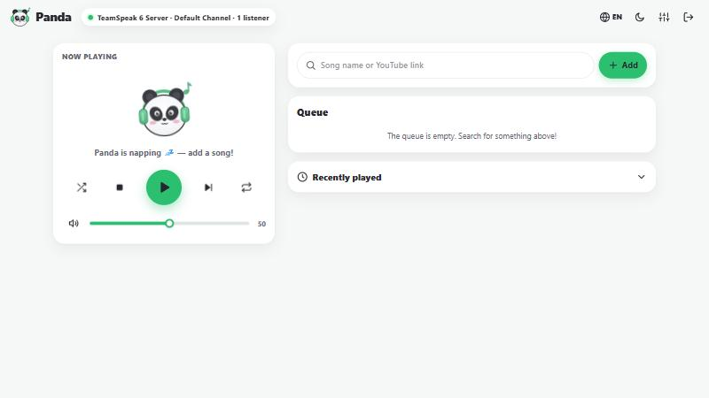
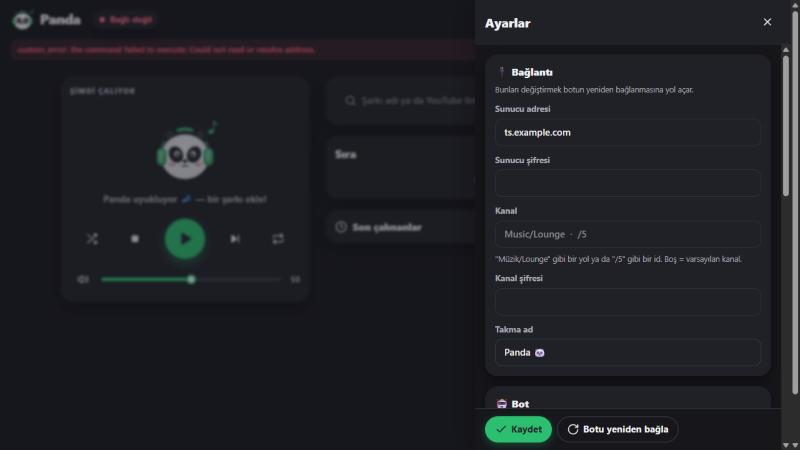

<p align="center">
  
</p>

<h1 align="center">Panda 🐼</h1>

<p align="center">
  <b>TeamSpeak 6</b> için minik, tatlı bir YouTube müzik botu — şirin bir web paneliyle.<br>
  <a href="README.md">English</a>
</p>

---

Panda TeamSpeak sunucuna girer ve YouTube'dan müzik çalar. Sohbete `!çal` ve şarkı adını ya da linkini
yazman yeterli; istersen web panelini kullan. Eklenti yok, script yok, arkada çalışan bir TeamSpeak
programı yok: Panda sunucuyla doğrudan konuşur, bu yüzden hafiftir (bot ~130 MB RAM kullanır,
`yt-dlp` ve `ffmpeg` sadece şarkı çalarken çalışır).

## Özellikler

- 🎵 **Sadece YouTube, ama hakkıyla** — adıyla ara ya da link yapıştır: `youtube.com`, `youtu.be`,
  **YouTube Music**, Shorts. Bir çalma listesinin içinden gelen link sadece o şarkıyı çalar.
- 🐼 **TeamSpeak 6 için yapıldı** (TS3 sunucularında da çalışır).
- 🌐 **Web paneli** — şimdi çalan, sürükle-bırak sıra, arama, geçmiş, ses, tekrar, ileri/geri sarma,
  açık/koyu tema, Türkçe/İngilizce.
- 💬 Türkçe ve İngilizce **sohbet komutları**.
- 🍪 **YouTube bot kontrolü mü?** Cookies'i panele yapıştır, bitti.
- 🔁 Kendi kendine yeniden bağlanır, kimliğini korur (yetkiler kalıcı olur), çalan şarkıyı açıklamasında gösterir.
- 📦 Tek dosya, tek komutla kurulum. Linux (x64/ARM), Windows, macOS ve Docker'da çalışır.

<p align="center">
  
  
</p>

## Kurulum (Linux)

```bash
curl -fsSL https://raw.githubusercontent.com/KaanBahaSever/panda/main/scripts/install.sh | sudo bash
```

Kurulum TeamSpeak sunucu adresini ve panel portunu sorar; `ffmpeg`, `yt-dlp` ve `deno`'yu kurar,
bir systemd servisi oluşturur ve sonunda panel adresiyle şifresini yazar. Güncellemek için aynı komutu
tekrar çalıştır.

```bash
journalctl -u panda -f                    # loglar
sudo systemctl restart panda              # yeniden başlat
curl -fsSL https://raw.githubusercontent.com/KaanBahaSever/panda/main/scripts/install.sh | sudo bash -s -- --uninstall
```

`yt-dlp` her gün kendini günceller (YouTube sık değişiyor, eski sürümler çalışmaz hale geliyor).

### Docker

```bash
git clone https://github.com/KaanBahaSever/panda && cd panda
docker compose up -d
docker compose logs panda                 # ilk açılışta panel şifresini gösterir
```

### Windows / macOS

[Releases](https://github.com/KaanBahaSever/panda/releases) sayfasından sistemine uygun arşivi indir,
[ffmpeg](https://ffmpeg.org/download.html), [yt-dlp](https://github.com/yt-dlp/yt-dlp#installation) ve
[deno](https://deno.com/)'yu `PATH`'e kur, sonra `panda`'yı (`panda.exe`) çalıştır. Ayarlar, başlattığın
yerdeki `data` klasöründe tutulur.

## İlk adımlar

1. Paneli aç (`http://sunucun:8080`) ve kurulumun yazdığı şifreyle giriş yap.
2. **Ayarlar → Bağlantı**: sunucu adresi (`ts.ornek.com` ya da `1.2.3.4:9987`), sunucu şifresi, kanal.
   Kaydedince bot yeniden bağlanır. Sohbet dilini **Ayarlar → Bot** kısmından Türkçe yap.
3. Panel şifresini **Ayarlar**'dan değiştir.
4. TeamSpeak'te botun kanalına `!çal tarkan şımarık` yaz. 🎶

## Sohbet komutları

Botun kanalına ya da bota özel mesaj olarak yaz. İngilizce karşılıkları da çalışır.

| Komut | İngilizce | Ne yapar |
|---|---|---|
| `!çal <ad veya link>` | `!play` / `!p` | Hemen çalar ya da sıraya ekler |
| `!şimdiçal <ad veya link>` | `!playnow` | Sırayı atlayıp hemen çalar |
| `!geç` | `!skip` / `!next` | Sonraki şarkı |
| `!dur` | `!stop` | Durdurur ve sırayı temizler |
| `!duraklat` / `!devam` | `!pause` / `!resume` | Duraklat / devam |
| `!sıra` | `!queue` / `!q` | Sırayı gösterir |
| `!şimdi` | `!np` | Ne çalıyor |
| `!ses <0-100>` | `!vol` | Ses seviyesi |
| `!tekrar <kapalı\|şarkı\|hepsi>` | `!loop <off\|one\|all>` | Tekrar |
| `!karıştır` | `!shuffle` | Sırayı karıştırır |
| `!sil <#>` / `!temizle` | `!remove` / `!clear` | Şarkı siler / sırayı temizler |
| `!gel` | `!join` | Kanalıma gel |
| `!yardım` | `!help` | Komut listesi |

Varsayılan olarak herkes botu kullanabilir. Sınırlamak için **Ayarlar → Bot** kısmına TeamSpeak
UID'leri ya da sunucu grubu ID'leri ekle.

## "Sign in to confirm you're not a bot" hatası

YouTube bazen sunucu IP'lerini engeller. Bir YouTube hesabının cookies'iyle çözülür:

1. **Gizli/özel** bir pencere aç ve YouTube'a giriş yap.
2. Cookies'i bir `cookies.txt` eklentisiyle dışa aktar (örneğin *Get cookies.txt LOCALLY*).
3. Gizli pencereyi hemen kapat (böylece cookies geçerli kalır).
4. Dosyayı **Ayarlar → YouTube cookies** kısmına yapıştır.

Bunun için yan bir hesap kullanmak iyi fikir.

## Ayarlar dosyası

Her şey panelden değiştirilebilir; dosya `/var/lib/panda/config.json` (ya da `data/config.json`).
Panel şifresini sıfırlamak için: `sudo -u panda /opt/panda/panda --data /var/lib/panda set-password <yeni>`.

Panel düz HTTP konuşur. İnternetten erişilebiliyorsa önüne HTTPS'li bir ters vekil sunucu
(Caddy, nginx) ya da güvenlik duvarı koy.

## Derleme

```bash
dotnet build src/Panda                    # .NET 8 SDK gerekir
bash scripts/build-release.sh linux-x64   # dist/ içine tek dosyalık sürüm
```

## Nasıl çalışıyor?

Panda, [TSLib](https://github.com/Splamy/TS3AudioBot) (bir TeamSpeak istemci kütüphanesi) üzerine
kurulmuş bir C# (.NET 8) uygulaması. TeamSpeak 6 sunucuları bağlantı sırasında TSLib'in tanımadığı yeni
bir lisans bloğu gönderiyor; Panda bunu okuyan küçük bir yama içeriyor (bkz. [`lib/`](lib/README.md)).
Ses `yt-dlp` ile gelir, `ffmpeg` ile çözülür ve [Concentus](https://github.com/lostromb/concentus) ile
Opus'a çevrilir.

## Lisans

Panda, üzerine kurulduğu TSLib gibi [Open Software License 3.0](LICENSE) ile lisanslanmıştır.
Panda'nın TeamSpeak veya YouTube ile bir bağlantısı yoktur.
